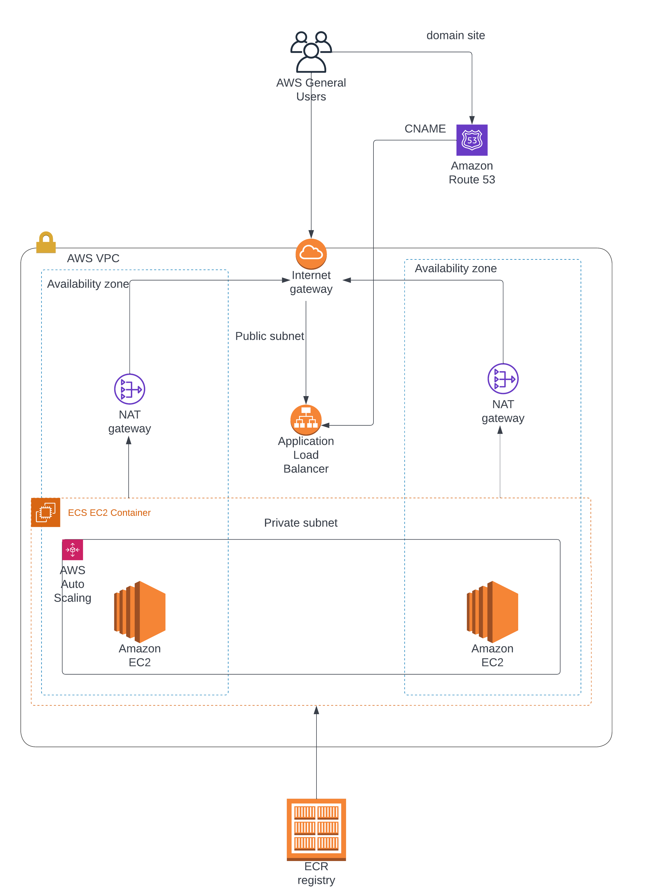

# ECS service with dummy hello world

## Introduction

It's required to deploy an ECS with a dummy container with a dummy hello world.

## Solution

### Architecture



### Usage

To use the code for this, it first is a must to modify some variables in the file `main.tf`, these are:

```textinfo
* domain_site
    * Must contain a string indicating a DNS name desired for the web page that will be created, for example: dummypoc.test
route53_zone_id
    * This must contain the Zone Id of an owned dns zone (this code doesn't contemplate the creation of it)
    * For HTTPS to work, the domain needs to be a registered one
```

Changed those values, to execute the creation of the stack is needed to run:

```textinfo
terraform init
terraform plan
terraform apply
```

Approve the validation of `apply` and after some minutes the stack should be up and running, you could visit it at the domain site you provided in `main.tf`, so for example if you provided `dummypoc.link`, then to access you need to go to `http://dummypoc.link` (if you go against `http` the Application Load Balancer will automatically redirect you to `https`).

### Decisions taken during the development

First, it was needed to design a draft about how the stack was gonna look, the design was carried out keeping in mind the points that will be positively valued, which are:

* Cost optimization
* Deployment without outage
* HTTPS

#### Cost Optimization

The challenge asked about using ECS, this service can run either on Fargate or EC2 (called "launch type"), and depending on which one is used is how the billing will work.


##### Fargate

Fargate is a serverless container service, it launches containers only for as long as they are needed, and then they are shut down. For Fargate the billing is calculated according to:

* Number of ECS tasks you ran during the period it's up
* Duration of each task ran
* Number of virtual CPUs (vCPUS) that are used for the task (charged per vCPU hour)
* Memory used for the task in GB (charge per GB-hour)

##### EC2

EC2 is a virtual machine spined up in the AWS Cloud, when ECS is run with EC2 as launch type, the billing will be calculated based on the AWS resources used, such as EC2 instances and EBS volumes, there aren't minimum rates or upfront commitments.
On top of it Amazon provides five different ways to pay for EC2 instances, those are:

* On Demand: Charge is based only on the compute capacity usage, it's possible to choose a billing per-hour or per-second, and the prices will vary among different instance types. If On-demand is used, long-term commitments and upfront payments will be eliminated, and a high level of scalability will be obtained.
* Reserved Instances: This model can provide up to 72% in savings, in this case, there is set an upfront commitment of 1 or 3 years for the EC2 instances, due to this it tends to be used for applications that operate with a steady state usage.
* Spot Instances: In this payment model, is requested spare EC2 capacity, and the payment could be significantly less, up to 90% off from the original on-demand price. The disadvantage of it is that these instances can be interrupted on short notice, so they tend to be used to accommodate urgent spikes in demand for compute resources or for flexible start/end schedules.
* Saving Plans: This payment model is similar to the one of reserved instances, it's given a discount on the price measured in a $/hour way, and it's based on long-term commitments (also 1 or 3 years).
* Dedicated host: EC2 instance capacity is provided on a dedicated physical server that is dedicated to your workloads, it allows you to also use existing server-bound software licensing, by using your dedicated server and license, it's possible to reduce costs.

##### Fargate vs EC2

By taking into consideration the way each launch type is billed, it's possible to arrive at certain conclusions:

* Fargate will optimize costs when the cluster utilization falls under certain thresholds, so for example when the tasks running on the cluster are running for certain pre-known times of execution and use of resources, following a pattern of execution (for example they always in average tend to take use the same time/resources).
* EC2 will optimize costs when the time utilization of the cluster is not well known before hand, as it's for example tasks that don't follow a pattern on how much time they take to run. Or either for example when the cluster utilization will be at max and/or when there's a peak on traffic as it can be set up a autoscaling group with a pre-given instance type that will scale-up when the peak occurs and scale-down when the peak has been passed.

By taking into consideration the presented 2 points, it was then  determined to design the ECS cluster by using EC2 as the launch type and with spot-instances that **can give a saving up to 90% of savings (on top of this, it's possible to specify in the creation of the stack how much will be the max price for spot instances that one is willing to pay for)** and with an autoscaling group that in case of a peak the cluster will automatically scale-up and once the threshold is no longer meet it will automatically scale-down.


Having a cluster with the described specifications can help significantly optimise costs.

##### Deployment without outage & HTTPS

In the case of deployment without outage, ECS by default does a rolling update, with this approach tasks are gonna be replaced with new ECS tasks, there's defined a minimum and the maximum number of tasks allowed during a deployment.
For example, the default task will allow a maximum of 2 tasks (200% of the services' desired count) and a minimum of 1 task (100% of the desired count), this is translated that during a new deployment a new task will be created before the old ones is terminated, in short this means than when a deployment is taking place there will be no outage as the current version will still be running on a given task while the new version is deployed into a new task but the old version will not be terminated until the new deploy is complete, once it's complete, then ECS will proceed to make the deploy of the remaining tasks to meet the maximum desired count (it also was decided to use ECR as the container registry as it's natively integrated with AWS).

The terraform developed allows to specify the number of desired tasks, by default it's set to 2.

But, there's still a piece missing in achieving no outage, which is, the way that incoming connections will be redirected to each running task, the way that was designed for this to be not an issue is found on the same solution determined for HTTPS, which is to utilize an Application Load Balancer.

It was chosen to utilize an Application Load Balancer as it provides out-of-the-box HTTPS termination on it's endpoint, the HTTPS certificate is leveraged with Amazon Certificate Manager and it's validated with DNS by leveraging an owned Route53 Zone.
This ALB as well will be redirecting the traffic into the backends (the running tasks in the ECS cluster), resulting that if a deployment of a new version is taking place, users/services consuming the workers will not notice an outage as the ALB will be redirecting the traffic to the healthy running tasks.

In summary, by leveraging an ALB (on top of the deployment strategy built-in in ECS) is possible to obtain a stack without deployment outages and with HTTPS.

### About terraform

Terraform is powerful for doing IaC made by Hashicorp, with a big community behind, multiple available resources to interact with AWS, and a lot of modules (which in short, leads to not re-invent the wheel and/or just refactoring existing ones as needed) as well with different frameworks around (e.g: terrspace), and an easy learning curve and set-up and run.
Due to the reasons just mentioned it was the tool chosen to carry out this challenge.
It was decided to create a module `ecs-ec2` as it allows to easily re-utilize/re-implement the given stack if it's needed.

### Conclusion

The stack was designed with the goal of cost optimization by leveraging ECS + EC2 with spot instances and autoscaling, and a deployment without outages and with HTTPS using an ALB.

### Reference

### Reference

* https://aws.amazon.com/blogs/containers/theoretical-cost-optimization-by-amazon-ecs-launch-type-fargate-vs-ec2/
* https://aws.amazon.com/fargate/pricing/
* https://aws.amazon.com/ec2/pricing/
* https://aws.amazon.com/ec2/spot/pricing/
* https://docs.aws.amazon.com/wellarchitected/latest/cost-optimization-pillar/welcome.html
* https://aws.amazon.com/blogs/containers/cost-optimization-checklist-for-ecs-fargate/
* https://ec2spotworkshops.com/ecs-spot-capacity-providers.html
* https://spot.io/resources/aws-pricing/aws-ecs-pricing-3-pricing-models-and-5-cost-saving-tips/
* https://spot.io/blog/aws-fargate-pricing-how-to-optimize-billing-and-save-costs/
* https://www.cloudforecast.io/blog/aws-ecs-pricing/
* https://www.tothenew.com/blog/aws-cost-optimization-series-blog-3-leveraging-ec2-container-service-ecs/
* https://support.huaweicloud.com/en-us/price-bestpract/en-us_topic_0088404785.html